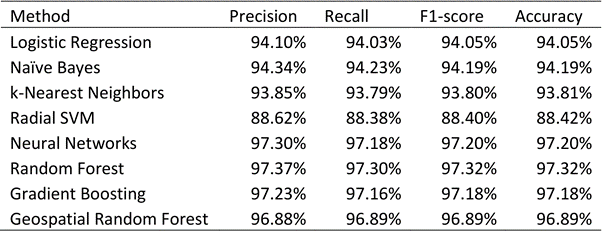

# water_point_status_prediction

### Summary

This is the final report for the capstone project for my Master's in Analytics in Georgia Tech. The goal of the project was to build a classification model to predict the status of water points, whether a water point functions properly or not. We built a random forest model with accuracy of 97.32% accuracy and with F-1 score of 97.32%. We used Python for most of the analysis and ArcGIS pro for geospatial analysis including density-based clustering and hotspot analysis.

### Dataset

Below datasets are used:
* [Water Point Data](https://www.waterpointdata.org/access-data): This dataset is made by [Water Point Data Exchange](https://www.waterpointdata.org). It has 118,110 data points with 52 attributes including latitude, longitude, and the current status of each water point. It is being updated continuosly.
* Soil, population, urban or rural information by location : [Esri database](http://sdf). License is needed for the Esri database.

### Statistical Methods
* Data imbalance handling: undersampling
* Encoding category features: label encoding, one-hot encoding
* Models: Logistic regression, Naive Bayes Classifier, kNN, Radial SVM, Neural Networks, Random Forest, Gradient Boosting Classifier.

### Performance Summary
Random Forest with Label encoding on balanced datset performed the best with accuracy of 97.32% and with F-1 score of 97.32%.

  

